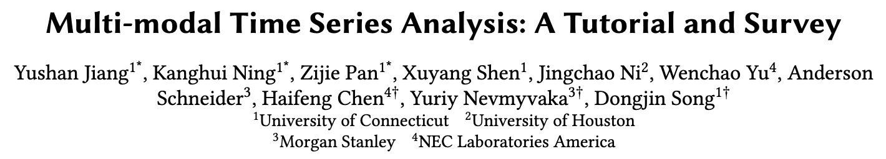
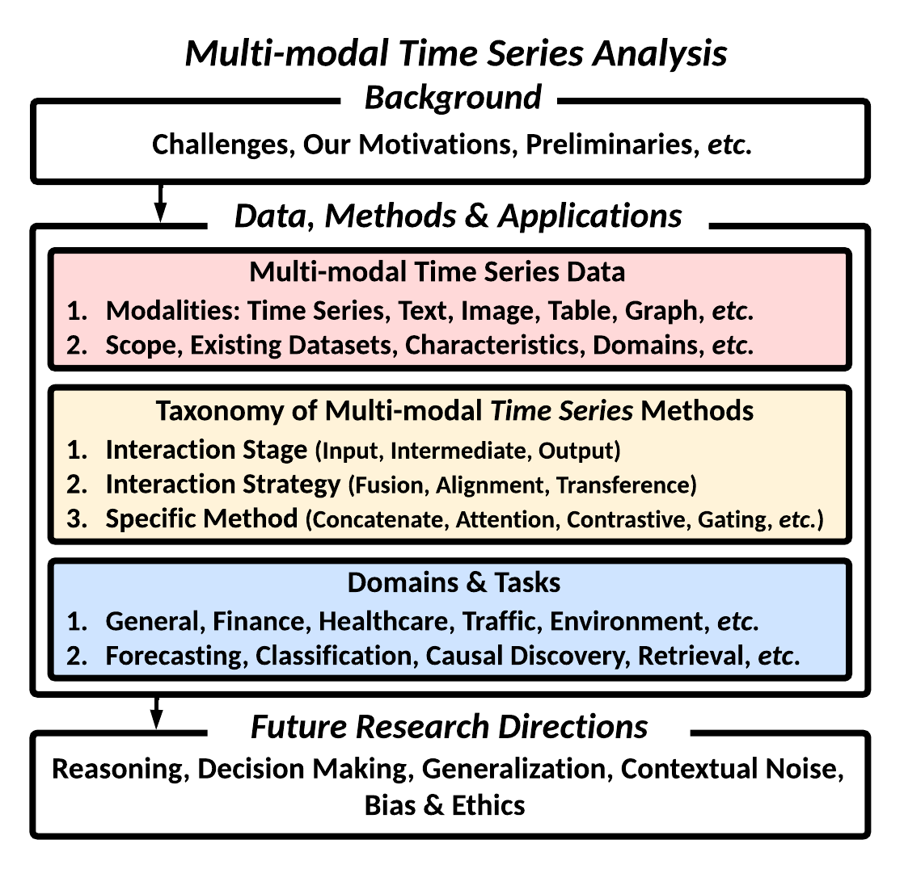
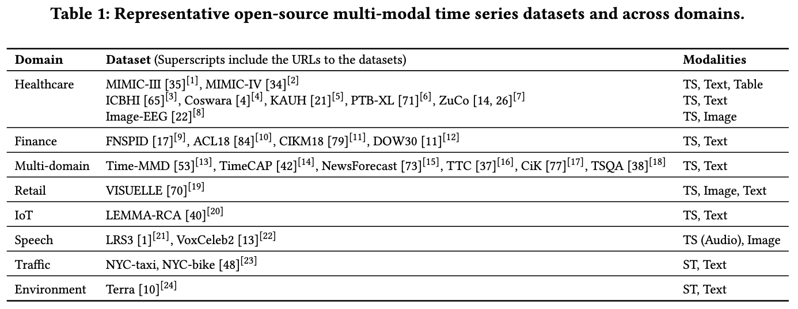
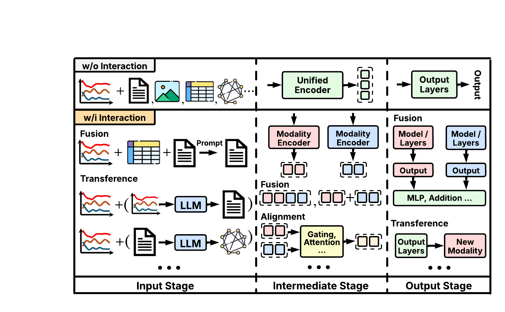
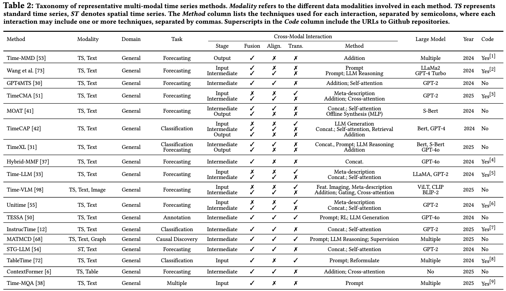
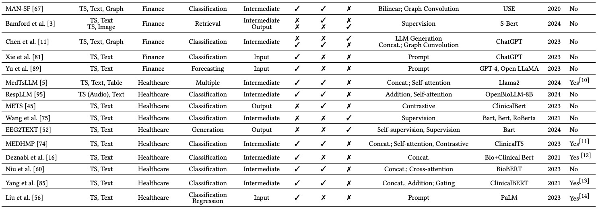
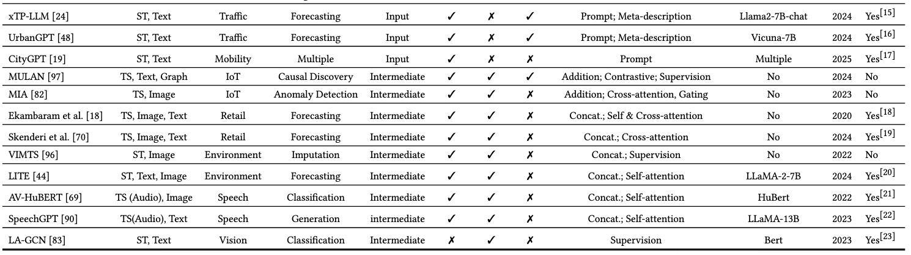

# 多模态时间序列分析综述

---

## 1. 综述简介与资源

**研究动机与主要贡献**  
近年来，多模态时间序列分析（Multi-modal Time Series Analysis）已成为数据挖掘与深度学习领域的研究热点。该研究领域旨在通过整合文本、图像、表格和图数据等多种模态的信息，进一步提升时间序列建模的表达能力与下游任务的效果。本文的聚焦于现实的多模态输入场景，从数据、方法及应用三个角度，对这一前沿领域进行了系统而全面的综述。此外，文章探讨了多个实际场景下的应用案例，展示了跨模态的时序协同分析的优势，从而为相关从业者和研究者提供了系统的理论依据和实践指南。 

**Arxiv地址**  
https://arxiv.org/abs/2503.13709

**GitHub链接**  
https://github.com/UConn-DSIS/Multi-modal-Time-Series-Analysis

---

## 2. 综述结构简介

本论文主要涵盖背景与动机、多模态时序数据介绍、多模态时序建模方法、应用与案例以及未来方向与挑战五个方面。1）在背景与动机部分，本文讨论了多模态时间序列数据的重要性以及其面临的数据异质性、模态固有差异和数据噪声等关键挑战；2）在多模态时序数据介绍中，介绍了常见模态及代表性的开源数据集；3）而在多模态时序建模方法中，重点阐述了跨模态交互（如融合、对齐和迁移）的核心思想，并对创新的分类体系和代表性模型进行了分析；4）随后，通过应用与案例章节展示了医疗、金融、交通、环境科学等领域的最新进展；5）最后，本文探讨了多模态时序推理、可解释性、可泛化性以及数据噪声鲁棒性等问题。

**论文结构**

---

## 3. 多模态时间序列数据介绍

**1）开源数据集收录**  
- 论文中汇总了若干常用的开源多模态时间序列数据集，覆盖医疗、金融、城市交通、物联网、环境等多种场景。  
- 每个数据集包含时间序列，结合文本、图像、表格等数据，为多模态时序分析提供素材。

**数据集**

---

## 4. 多模态时序建模方法框架： 

本文针对现有多模态时间序列方法，提出了一个创新性的统一框架，包括了不同阶段（输入、中间阶段、输出）的不同交互方法：

1. **融合（Fusion）**  
   - 将时间序列与文本、图像等不同模态信息在输入或中间表示层面进行合并  
   - 技术手段：提示（Prompt）、拼接、注意力机制、多模型输出融合等

2. **对齐（Alignment）**  
   - 解决不同模态在时间尺度与语义层面的不一致问题  
   - 可采用自注意力、交叉注意力、图卷积、对比学习等技术手段  
   - 输入、中间、输出三个阶段均可进行对齐策略

3. **转换（Transference）**  
   - 模态间的转化或生成  
   - 举例：从数值时间序列生成文本描述，或通过生成图像表示辅助时间序列学习  
   - 适用于数据增强、跨域学习、多任务协同等场景

**代表性跨模态交互范例**  

---

## 5. 统一分类体系 (Taxonomy)

作者基于大量文献调研，对多模态时间序列模型做了系统分类，包括模态、下游任务、交互类型与阶段、应用场景等，并列举了典型方法进行了总结和分析。

**通用领域**

**金融及医疗领域**

**其他领域**

---

## 6. 实践与应用场景

**1）医疗健康**  
- 整合多种数据源（如电子健康记录、音频、脑电图、心电图及其他可穿戴传感器数据） 
- 利用电子健康记录中临床文本+患者时序体征的组合，显著改善生存率、住院再入院等预测
- 针对音频、脑电图、心电图等数据开发的定制多模态方法，用于呼吸健康分类、心脏信号分析等医疗任务

**2）金融交易**  
- 将市场时间序列（股价、交易量等）与新闻文本或社交媒体信息融合，辅助趋势预测  
- 金融市场中，融合多模态信息可以更全面地评估市场情绪

**3）交通与环境**  
- 结合地理空间数据、交通流量序列与天气新闻报道，用于更精准的出行预测与区域规划  
- 环境监测中，多模态信息的整合能够有效解决数据缺失问题，提升环境时空预测的准确性

**4）物联网**  
- 工业设备故障诊断，融合传感器时序与日志文本或图像监控

---

## 7. 本文总结

多模态时间序列分析作为一门交叉领域，不仅蕴含着广阔的发展前景，也面临着诸多挑战与机遇。本文系统整合了现有的研究成果，提出了一套涵盖数据融合、对齐及迁移等交互机制的统一分析框架和分类体系，从理论和实践两方面为研究者提供了全新的思路和实用指导。多模态时序分析的应用领域与成果涵盖医疗、金融、物联网、交通、零售等多个场景，为未来的学术研究和产业应用奠定了坚实的基础。

---
